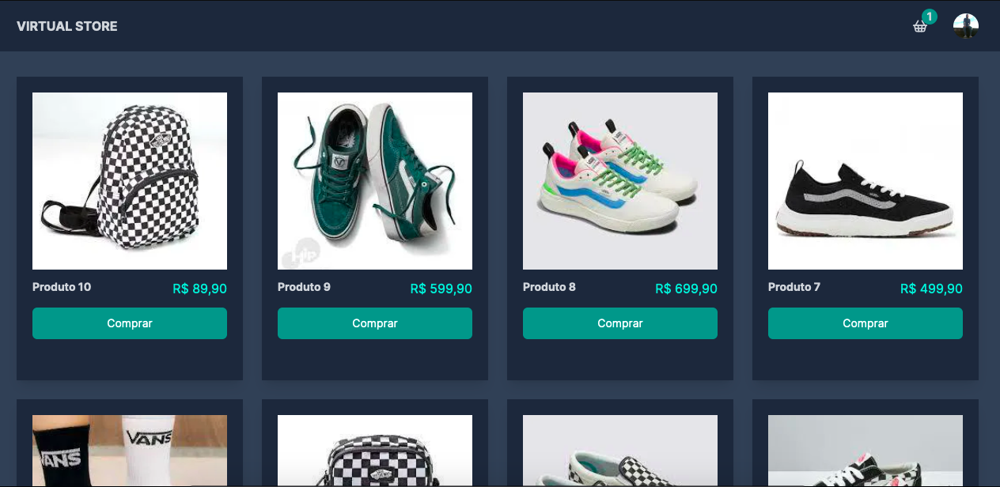
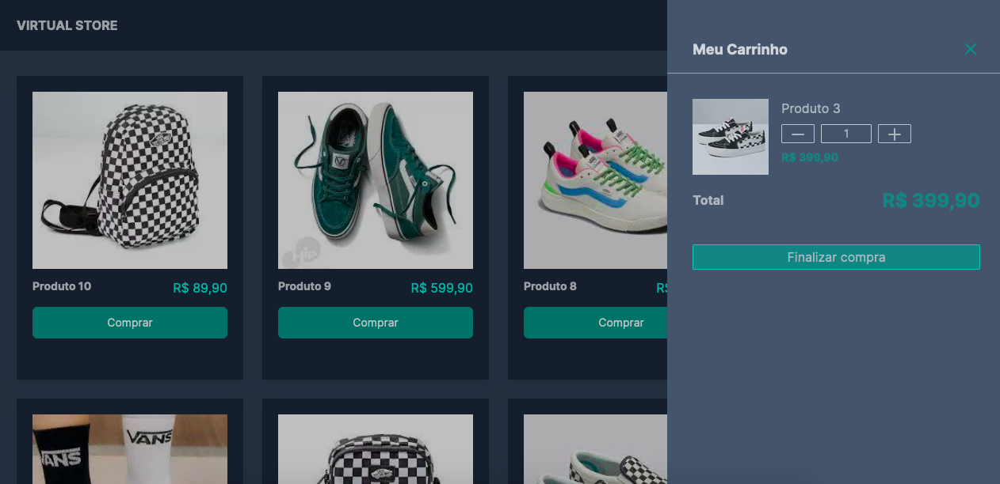

# Virtual Store 💊

<p>
Bem-vindo à Virtual Store, sua loja virtual premium para moda contemporânea. Explore nossa seleção cuidadosamente curada de tênis, roupas e bolsas, refletindo as últimas tendências. Garantimos qualidade superior com marcas líderes, oferecendo uma experiência de compra online segura e conveniente. De modelos clássicos a peças elegantes, a Virtual Store é o seu destino para expressar seu estilo único com praticidade e sofisticação. Descubra a moda sem sair de casa, onde cada clique é uma declaração de estilo na Virtual Store
</p>

# Screens

<p align="center">
  
  
  
</p>

## Technologies used

- [ReactJS](https://pt-br.reactjs.org)
- [NextJS](https://nextjs.org)
- [Typescript](https://www.typescriptlang.org)
- [Tailwindcss](https://tailwindcss.com)
- [Prisma](https://www.prisma.io/)
- [Clerk](https://clerk.com/)
- [Zustand](https://github.com/pmndrs/zustand)
- [Supabase](https://supabase.com/)
- [Stripe](https://stripe.com/br)

## Requirements

You need to install [Node.js](https://nodejs.org)

## How to use it

```bash
# Repository clone
$ git clone https://github.com/Gui-dev/tickets.git
# Install the dependencies
$ npm install
# Prisma Client
$ npx prisma generate
# Run the web server
$ npm run dev
```

The application will be available to access in your browser on localhost (http://localhost:3000)

The app will be available for access on your browser at (https://virtual-store-mu.vercel.app/)
